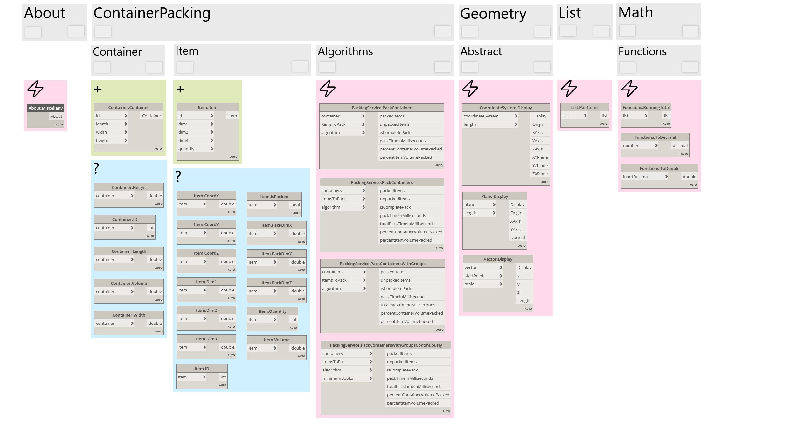

# Miscellany for Dynamo

A collection of miscellaneous nodes for [Dynamo 2](http://www.dynamobim.org/) including an implementation of the C# library [3DContainerPacking](https://github.com/davidmchapman/3DContainerPacking) to use the [EB-AFIT container packing algorithm](https://github.com/wknechtel/3d-bin-pack) in Dynamo

## Installation
**Miscellany** is available on the Dynamo package manager.

## Documentation and Samples
See [Sample dyn files](Samples) and the [Project Wiki](https://github.com/thomascorrie/Miscellany/wiki) for documentation.

## Future Development and Issue Tracking
See [Issues](https://github.com/thomascorrie/Miscellany/issues) for planned improvements and open issues.

## Contributing
Contributions are welcome: [CONTRIBUTING.md](CONTRIBUTING.md). 
1. Fork this repository
2. Create a feature branch, e.g. feature/myFeature
3. Commit your changes and push to your branch
4. Create a new pull request

## Prerequisites
Dynamo 2.0 or later  
.Net 4.6

## Licence
[MIT](LICENSE). Releases up to and including 1.2.0 were published under earlier licences (LGPL-3.0 in this repository, AGPL-3.0 on the Dynamo package listing).

Third-party components are listed in [THIRD-PARTY-NOTICES.md](THIRD-PARTY-NOTICES.md).

## Author
Thomas Corrie: [GitHub](https://github.com/thomascorrie) - [Twitter](https://twitter.com/didymuscoombe) - [Website](http://www.thomascorrie.com)

## Acknowledgements
The Container Packing nodes build on the C# library [3DContainerPacking](https://github.com/davidmchapman/3DContainerPacking) by [David Chapman](https://github.com/davidmchapman) which in turn is based on the C library [3d-bin-pack](https://github.com/wknechtel/3d-bin-pack/) by [Bill Knechtel](https://github.com/wknechtel) which resurrects a thesis by Ehran Baltacıoğlu at the Air Force Institute of Technology.
