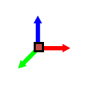
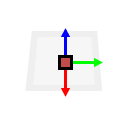
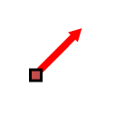
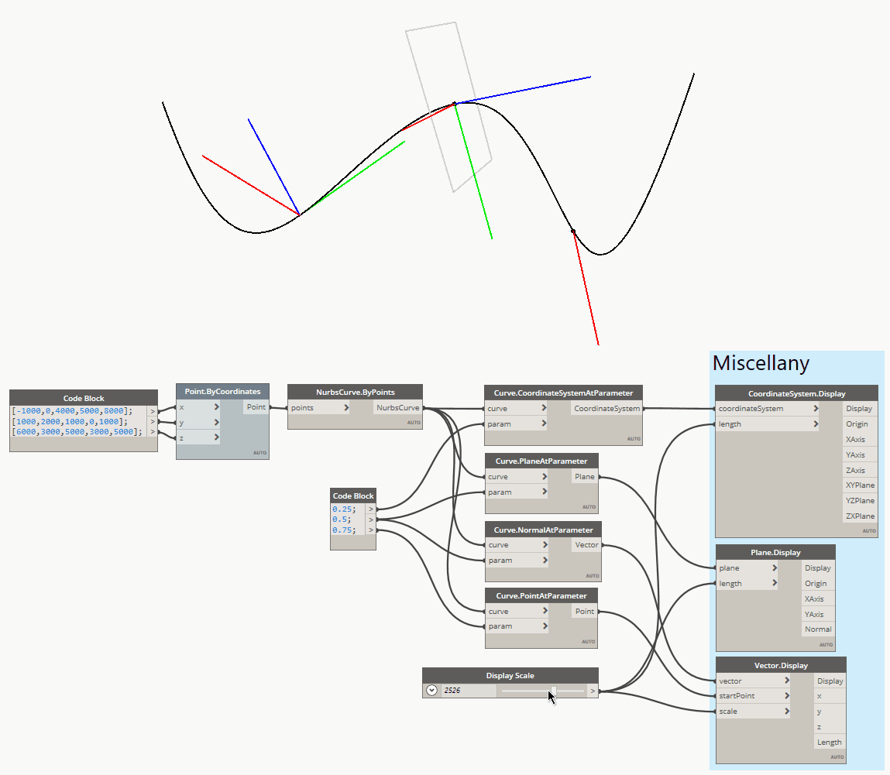

[Documentation](README.md) › Geometry

# Geometry

Code: [Abstract.cs](../Miscellany/Geometry/Abstract.cs)
Sample file: [Miscellany-Samples-GeometryDisplay.dyn](../Samples/Miscellany-Samples-GeometryDisplay.dyn)

When you work in millimetres, Dynamo draws CoordinateSystems and Planes so small that they're hard to see, which is awkward when working with complex geometry. These three nodes use Dynamo's `GeometryColor.ByGeometryColor` to draw scalable, colour-coded versions (X red, Y green, Z or normal blue). Each node also returns the object's main properties, so you don't need separate nodes to get them.

## Abstract.CoordinateSystemDisplay

A scalable display of a CoordinateSystem's axes. It also outputs the origin, the three axes and the three planes. The `length` input sets how long the axis lines are drawn (default 1000).

## Abstract.PlaneDisplay

A scalable display of a Plane's axes and normal, with a translucent square showing the plane itself. It also outputs the origin, the axes and the normal. The `length` input sets the size of the display (default 1000).

## Abstract.VectorDisplay

A scalable display of a Vector, drawn from a chosen start point. It also outputs the vector's x, y and z components and its length. The drawn line is the vector's length multiplied by `scale` (default 1000), so for a unit vector the line is `scale` long.

> In versions up to 1.2.0 these nodes were called `CoordinateSystem.Display`, `Plane.Display` and `Vector.Display`. Graphs that use the old names are upgraded automatically when opened.
