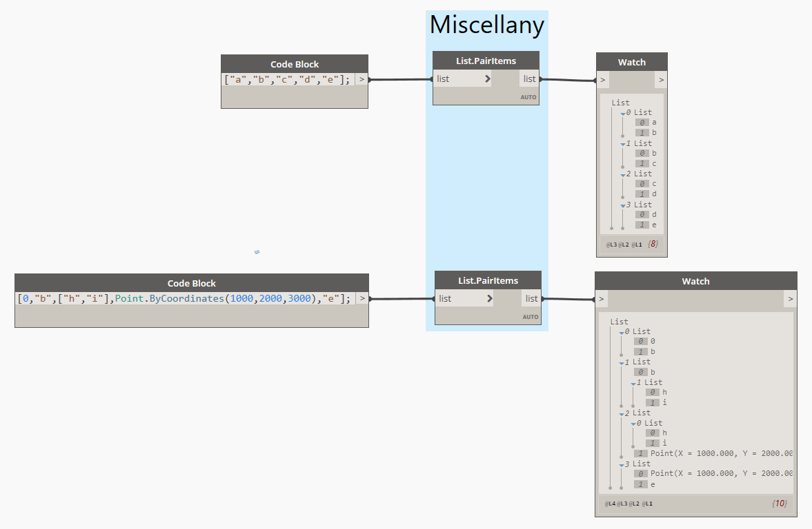

[Documentation](README.md) › List

# List

Code: [Lists.cs](../Miscellany/Lists/Lists.cs)
Sample file: [Miscellany-Samples-List.dyn](../Samples/Miscellany-Samples-List.dyn)

## Modifies.PairItems

Takes a list and pairs each item with the next one: `[a,b,c,d]` → `[[a,b],[b,c],[c,d]]`. A list with fewer than two items returns an empty list.

> In versions up to 1.2.0 this node was called `List.PairItems`. Graphs that use the old name are upgraded automatically when opened.
