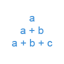
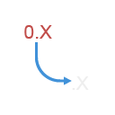
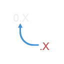

[Documentation](README.md) › Maths

# Maths

Code: [Maths.cs](../Miscellany/Maths/Maths.cs)

## Maths.RunningTotal

Returns the running total of a list of numbers: `[1,2,3,4]` → `[1,3,6,10]`.

## Maths.ToDecimal

Converts a number (double) to a decimal. Values beyond the decimal range (about ±7.9 × 10²⁸) are clamped to the smallest or largest decimal.

## Maths.ToDouble

Converts a decimal back to a double.

> In versions up to 1.2.0 these nodes were called `Functions.RunningTotal`, `Functions.ToDecimal` and `Functions.ToDouble`, in the `Miscellany.Math` namespace. Graphs that use the old names are upgraded automatically when opened.
